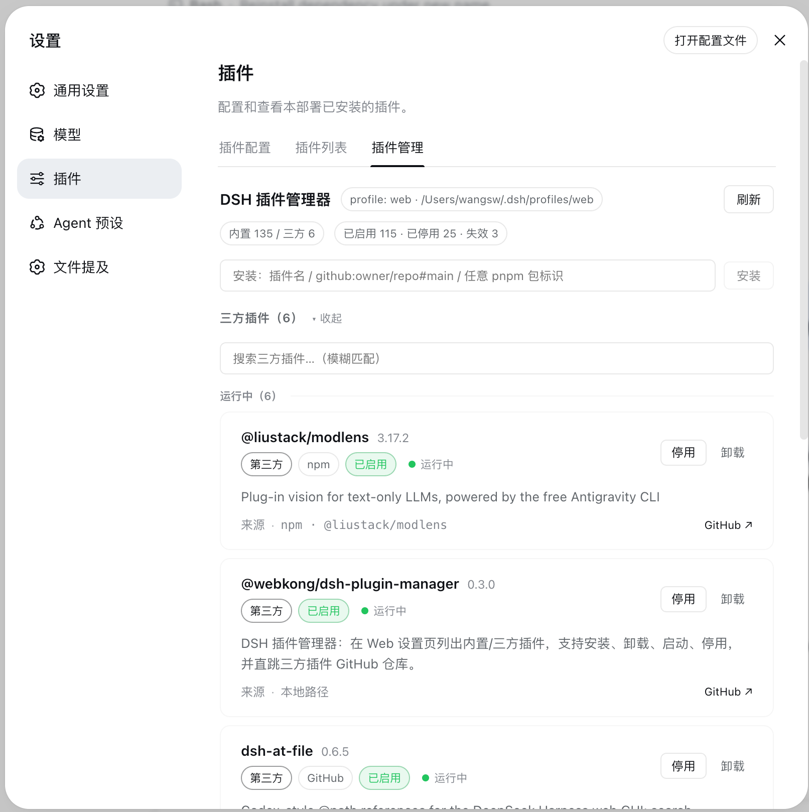

# dsh-plugin-manager

A plugin manager for [DeepSeek Harness (DSH)](https://github.com/deepseek-ai/deepseek-harness). It adds a **Plugin Manager** page to the Web settings: list **built-in / third-party** plugins, **install, uninstall, start, stop**, and jump straight to a third-party plugin's GitHub repository.



## Features

- **Built-in vs third-party**: enumerates all built-in plugins from the live Loader (consistent with DSH's own list); packages in the profile `dependencies` are treated as third-party and manageable
- **Install**: `dsh plugin --profile web add <spec>` (npm name / `github:owner/repo#main` / any pnpm spec)
- **Uninstall**: `dsh plugin --profile web remove <name>`, plus cleanup of leftover stop entries
- **Stop / start**: resolves a bundle's loader entry ids and writes/removes `{ id, name, disabled: true }` in the profile `cordis.patch.yml`; falls back to editing the bundles list when ids can't be located
- **GitHub link**: a lightweight link at the end of the source row, derived from the dependency spec or the installed package's `repository` field
- **Auto-restart**: optional automatic restart of dsh web after install/uninstall (off by default, see Configuration)
- **Groups & search**: collapsible built-in / third-party groups, state subgroups (running / stopped / missing), fuzzy search
- **i18n**: 中文 / English, following the DSH language preference

> Install / uninstall / stop / start take effect **after a restart** (stop/start may apply immediately when HMR is active).

## Installation

```bash
# From GitHub
dsh plugin --profile web add github:webkong/dsh-plugin-manager#main

# Or from a local path (development)
dsh plugin --profile web add /path/to/dsh-plugin-manager
```

Restart dsh web, then open Settings → Plugins → **Plugin Manager**.

## Configuration

Manages the `web` profile by default. Override the profile in the bundle row:

```yaml
- insert:
    - id: pmgr
      name: '@webkong/dsh-plugin-manager'
      config:
        profile: web        # profile to manage (default: web)
```

The auto-restart toggle can be switched at any time in the UI (persisted to `~/.dsh/dsh-plugin-manager.json`).

## Development

```bash
pnpm build      # bundle client/src → lib/client.js with esbuild
pnpm check      # node --check all modules
pnpm test       # node --test unit tests
```

### Structure

```
dsh-plugin-manager/
├── package.json            # dsh.bundle / dsh.client declaration, scripts
├── cordis.patch.yml        # bundle patch: mounts the pmgr row
├── build.mjs               # bundles client/src → lib/client.js
├── lib/                    # Host half (zero external deps, plain ESM + node builtins)
│   ├── index.js            # entry: name/inject/apply + webServer route registration
│   ├── constants.js        # route prefix / stop marker / default profile
│   ├── handlers.js         # HTTP dispatch
│   ├── manager.js          # business layer (dependency-injected fs tools)
│   ├── fsutil.js           # node:fs + child_process + settings persistence
│   ├── resolve.js          # dual-anchor package resolution / metadata
│   ├── entryIds.js         # bundle patch entry id discovery
│   ├── github.js           # GitHub URL extraction
│   ├── patch.js            # cordis.patch.yml stop/start text ops
│   └── http.js             # JSON response / loopback guard
├── client/src/             # Client source (modular, bundled to one file)
│   ├── index.js            # apply entry + slots/locale registration
│   ├── api.js              # fetch wrapper + pmgr methods
│   ├── i18n.js             # zh / en dictionaries
│   ├── styles.js           # CSS injection
│   └── ui.js               # card / group / modal components
├── assets/screenshot.png   # screenshot
└── test/pure.test.mjs      # unit tests
```

### API

The Host exposes HTTP routes under `/pmgr/*` (loopback only), called by the client via `fetch`:

| Route | Description |
| --- | --- |
| `GET /pmgr/list` | plugin list + settings |
| `POST /pmgr/install` | install (`{spec}`) |
| `POST /pmgr/uninstall` | uninstall (`{name}`) |
| `POST /pmgr/stop` / `POST /pmgr/start` | stop / start (`{name}`) |
| `POST /pmgr/settings` | update settings (`{autoRestart}`) |
| `POST /pmgr/restart` | trigger a manual restart |

## License

[MIT](LICENSE)
