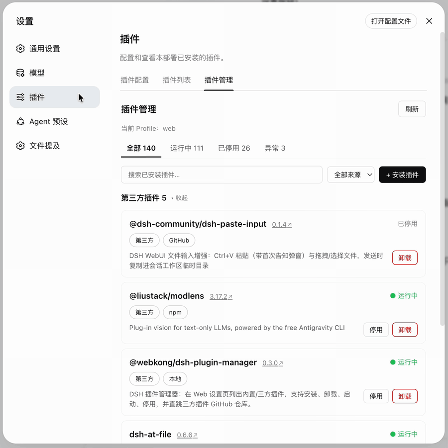
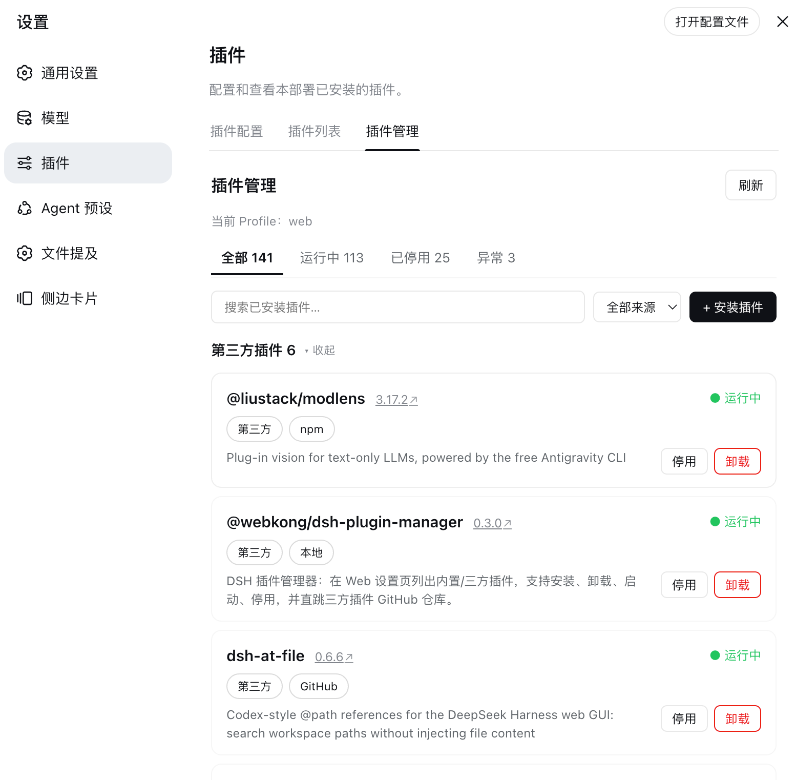
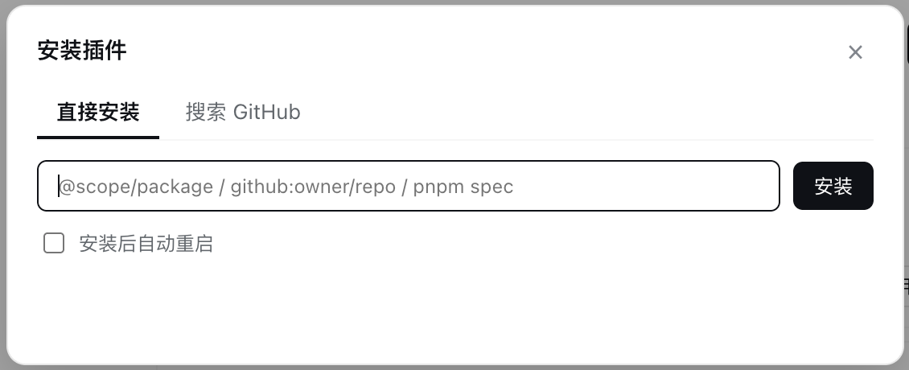

<p align="center">
  
</p>

<p align="center">
  <b>🚀 为 DeepSeek Harness 而生的插件管家</b><br />
  装 · 卸 · 启 · 停，一站式管理你的 DSH 插件生态
</p>

<p align="center">
  <a href="#-功能亮点">功能亮点</a> ·
  <a href="#-安装">安装</a> ·
  <a href="#-配置">配置</a> ·
  <a href="#-开发">开发</a> ·
  <a href="README.en.md">English</a>
</p>

---

# dsh-plugin-manager

让 DeepSeek Harness 的插件管理**第一次变得像点外卖一样简单**。

以前装一个 DSH 插件要翻 GitHub、敲命令、改配置；现在打开 设置 → 插件 → **插件管理**，内置 / 三方插件一览无余，安装、卸载、启停、GitHub 溯源全部在一个页面里完成。





## ✨ 功能亮点

### 🧭 全局视野，一目了然
- **内置 vs 三方**：以 Loader 实时行为主枚举全部 130+ 内置插件，与 DSH 自带列表完全一致；profile dependencies 中的自动识别为第三方、可管理
- **状态一眼可见**：运行中 ● / 已停用 / 加载失败，来源标签（npm / GitHub / 本地）、版本、GitHub 入口全在卡片上

### 🧩 安装，比你想象的更聪明
- **多种安装源**：npm 包名、`github:owner/repo#main`、本地路径、tarball URL，通通支持
- **裸包名智能解析**：输入 `dsh-paste-input` 这种裸名字，自动探测是 npm 包还是 GitHub 仓库——命中 GitHub 直接列出候选仓库，一键安装
- **GitHub 市场搜索**：按关键词搜 `topic:dsh-plugin`，发现生态里还没人注意到的宝藏插件

### 🎛 启停卸载，背后是精密的手术
- **停用 / 启动**：自动解析三方插件 bundle 的装载条目 id，向 profile 的 `cordis.patch.yml` 精确写入 / 移除 `disabled` 标记，对 reconcile 免疫
- **卸载**：干净利落，连残留的停用条目一起清理
- **GitHub 直跳**：点卡片上的版本号（↗）直达仓库，看文档、看 star、看代码

### ⚡ 自动化到最后一公里
- **自动重启**：装完自动重启 dsh web（可选，默认关），10 秒倒计时自动刷新页面，重启完成右上角 toast 一键跳回本页
- **GitHub token 自动发现**：环境变量 / gh CLI / shell rc / git config 逐级探测 `GH_TOKEN`，未配置时贴心地提示限流原因
- **筛选与搜索**：状态 Tab + 来源筛选 + 模糊搜索，内置 / 三方分组可折叠

### 🌏 为中文用户打磨
- 全中文界面 + English，跟随 DSH 语言偏好自动切换

> ⚠️ 安装 / 卸载 / 停用 / 启动均在**重启后生效**（若当前进程 HMR 已激活，停用/启动可能即时生效）。

## 📦 安装

```bash
# 从 GitHub 安装
dsh plugin --profile web add github:webkong/dsh-plugin-manager#main

# 或从本地路径安装（开发）
dsh plugin --profile web add /path/to/dsh-plugin-manager
```

重启 dsh web 后，进入 设置 → 插件 → **插件管理** 即可使用。

## ⚙️ 配置

默认管理 `web` profile。可在装载行配置覆盖，并关闭自动重启：

```yaml
- insert:
    - id: pmgr
      name: '@webkong/dsh-plugin-manager'
      config:
        profile: web        # 管理的 profile（默认 web）
```

自动重启开关在页面上可随时切换（持久化到 `~/.dsh/dsh-plugin-manager.json`）。

## 🔧 开发

```bash
pnpm install
pnpm build      # esbuild 打包 src/ → lib/（Host ESM + Client __ModuleLoader__ bundle）
pnpm typecheck  # tsc 双配置严格类型检查（node / DOM+React）
pnpm test       # node --test 纯函数单元测试（9 用例）
pnpm check      # typecheck + 产物语法检查
```

### 结构（TypeScript 模块化）

**v0.5.0 起源码整体迁移为 TypeScript 模块化组织**（参考官方 ui 插件结构），构建产物在 `lib/`：

```
dsh-plugin-manager/
├── package.json              # dsh.bundle / dsh.client 声明，scripts
├── cordis.patch.yml          # bundle patch：装载 pmgr 行
├── build.mjs                 # esbuild 三阶段构建（Host / Client / 纯函数子模块）
├── tsconfig.json             # Host 类型检查（node 环境）
├── tsconfig.client.json      # Client 类型检查（DOM + React 环境）
├── lib/                      # 构建产物（已 gitignore）
│   ├── index.js              # Host 单文件 ESM bundle
│   ├── client.js             # Client __ModuleLoader__ bundle
│   ├── entryIds.js           # 纯函数子模块（供单元测试 import）
│   ├── github.js / patch.js / spec.js
└── src/
    ├── host/                 # Host 源码（TypeScript，Node 环境）
    │   ├── index.ts          # 入口：name/inject/apply + webServer 路由注册
    │   ├── handlers.ts       # HTTP 分发（list/install/uninstall/stop/start/search/resolve/settings/restart）
    │   ├── manager.ts        # 业务层：清单、增删启停、搜索/解析（依赖注入 fs 工具）
    │   ├── fsutil.ts         # node:fs + child_process + 设置持久化
    │   ├── resolve.ts        # 双锚点包解析 / 元数据读取
    │   ├── entryIds.ts       # bundle patch 装载条目 id 发现
    │   ├── github.ts         # GitHub URL 提取 + GH_TOKEN 读取
    │   ├── spec.ts           # 安装 spec 校验
    │   ├── patch.ts          # cordis.patch.yml 停用/启用文本操作
    │   └── http.ts           # JSON 响应 / loopback 校验
    └── client/               # Client 源码（TypeScript，DOM + React 环境）
        ├── index.ts          # apply 入口 + settings tab / shell.overlay 注册
        ├── api.ts            # fetch 封装 + pmgr 方法表
        ├── components.tsx    # 状态 Tab / 工具栏 / 安装弹窗 / 插件卡片
        ├── i18n.ts           # zh / en 文案字典（键类型校验）
        ├── spec.ts           # 客户端 spec 校验 + 裸包名判定
        ├── styles.ts         # CSS 注入
        ├── toast.tsx         # 重启完成 toast + 一键跳转
        ├── types.ts          # 契约类型（wire 形状 / 弹窗状态）
        └── ui.tsx            # 页面编排 / 分组 / 操作弹窗
├── assets/                   # demo GIF + 截图
└── test/pure.test.mjs        # 单元测试（node --test）
```

### 通信契约

Host 通过 `webServer` 前缀路由 `/pmgr/*` 提供 HTTP API（仅限本机 loopback），客户端用浏览器 `fetch` 调用：

| 路由 | 说明 |
| --- | --- |
| `GET /pmgr/list` | 插件清单 + 设置 |
| `POST /pmgr/install` | 安装（`{spec}`） |
| `POST /pmgr/uninstall` | 卸载（`{name}`） |
| `POST /pmgr/stop` / `POST /pmgr/start` | 停用 / 启用（`{name}`） |
| `POST /pmgr/search` | 搜索 GitHub 插件（`{q}`） |
| `POST /pmgr/resolve` | 解析裸包名（npm 判定 / GitHub 候选） |
| `POST /pmgr/settings` | 更新设置（`{autoRestart}`） |
| `POST /pmgr/restart` | 手动触发自动重启 |

## 📄 许可证

[MIT](LICENSE)
